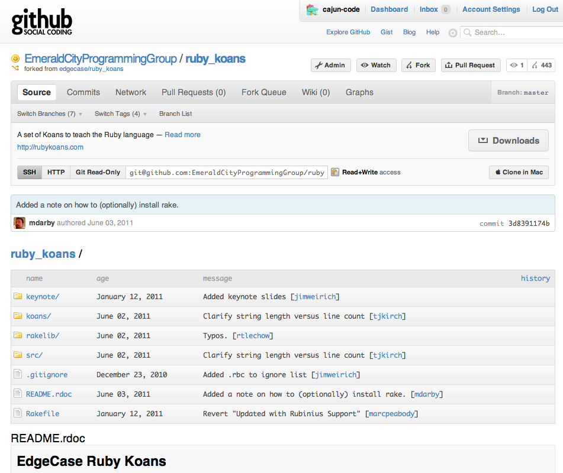
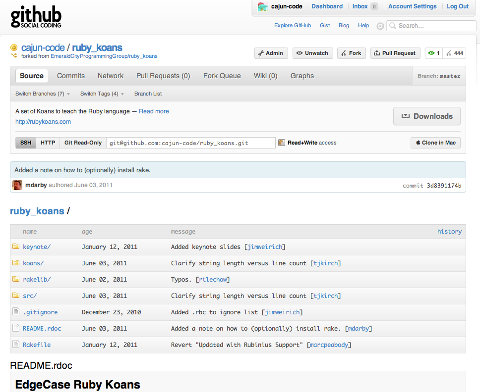

!SLIDE 
# Github #

!SLIDE bullets incremental small
# Fork The Repo #

* Login to Github
* go to https://github.com/EmeraldCityProgrammingGroup/ruby_koans
* Click the "Fork" button

!SLIDE center full-screen

!SLIDE center full-screen

!SLIDE bullets incremental
# Clone the Repo #

* On your fork click the clipboard to copy the URL
* Open the commamd prompt.  

!SLIDE command
  
    $ git clone <copied URL from github >
  

